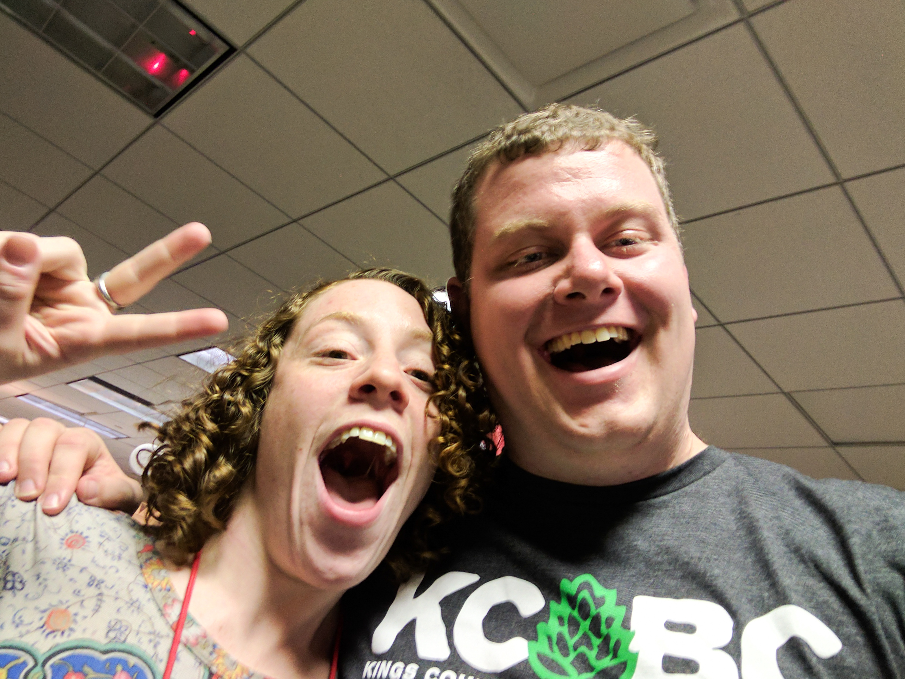

Dear Amy,

It was a pleasure working with you in 2016. I cannot properly express to you how much your honesty, positivity, hard work and caring attitude improved my day to day experience with the campaign and how much it improved TechOps. That being said, I am going to try.

Before you joined, Ops was a wreck. We were doing good work, but the three of us were bursting at the edges. It took a while for timball, fisher and I to get used to there being a fourth Ops person, and for that I apologise. But once the four of us started grooving, I felt like we were unstoppable. I truly can not think of a point from after you were hired where I was worried about our teams ability to deal with incoming problems. This was not the case previously, and I can truly point to your hard work and attitude as the reason that change happened in the team.

So thank you. I am honored to have had the chance to work alongside you in the trenches. If I can ever help in any way, please reach out. Please keep in touch and good luck in the future.

Sincerely,  
/Nat

