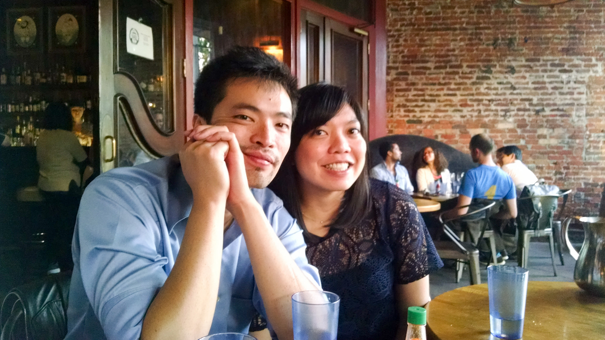

# Happy Birthday Jeanne!

Hello my dear,

It's your old roomie Nathaniel Welch. I miss you and our various talks. I appreciate that you've kept in touch with wonderful postcards and quick messages here and there. You're a true friend.

So this year, on the culmination of your thirty first trip around the sun, I wanted to write you a letter.

You see I'm horrible at these sorts of things, which is why, even on the internet, this will get to you late. But I wanted to thank you for being a great friend. I love how you share what you're up to with the world, how you keep your friends close, and how brightly you burn when you're talking about your passions.

I want to wish you the best, because not only do you deserve it, but you're going to get it. I miss you, but I'll see you at some point during your upcomming trip around the sun. Speaking of which, for your next journey, and all the ones to come, I have a quote from Patrick Rothfuss which I believe is perfect:

 > May all your stories be glad ones, and your roads be smooth and short.

Lots of love,  
/Nat

