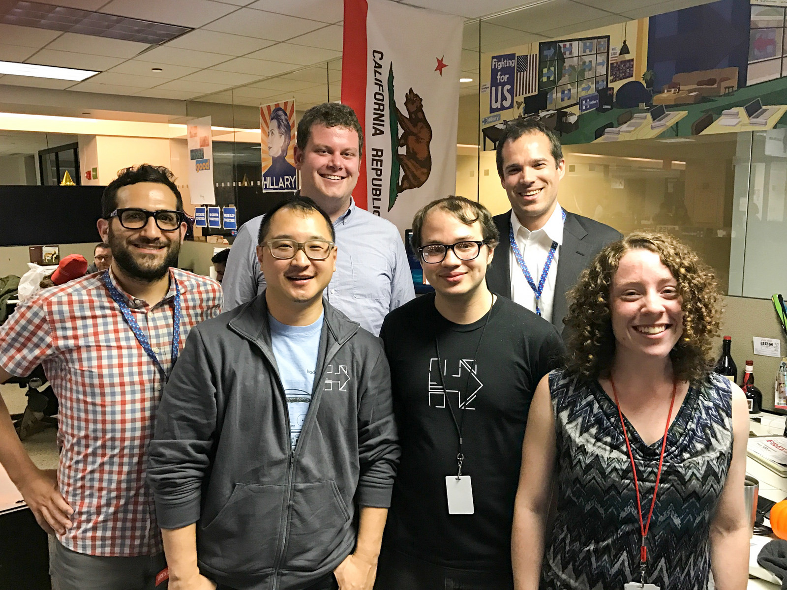
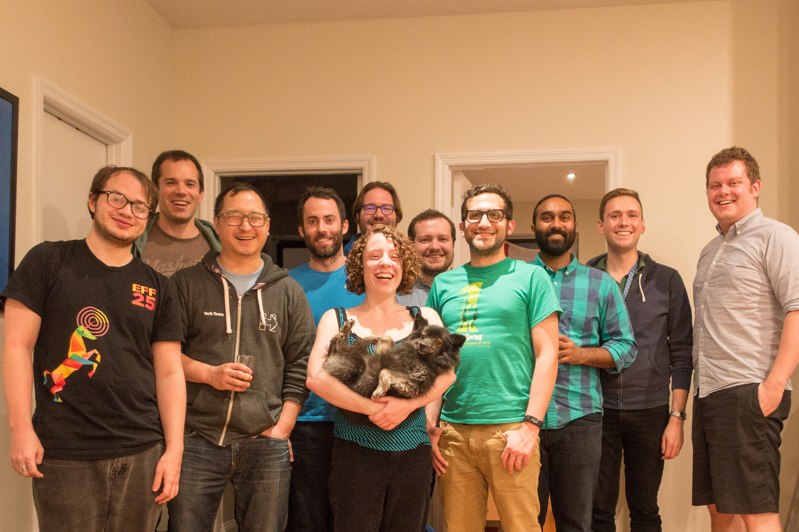
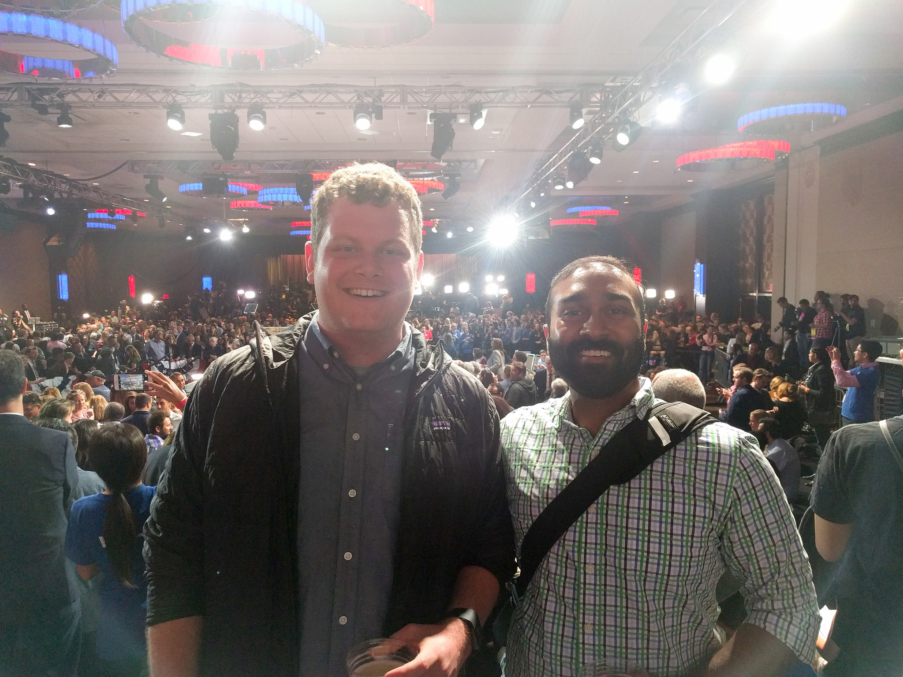
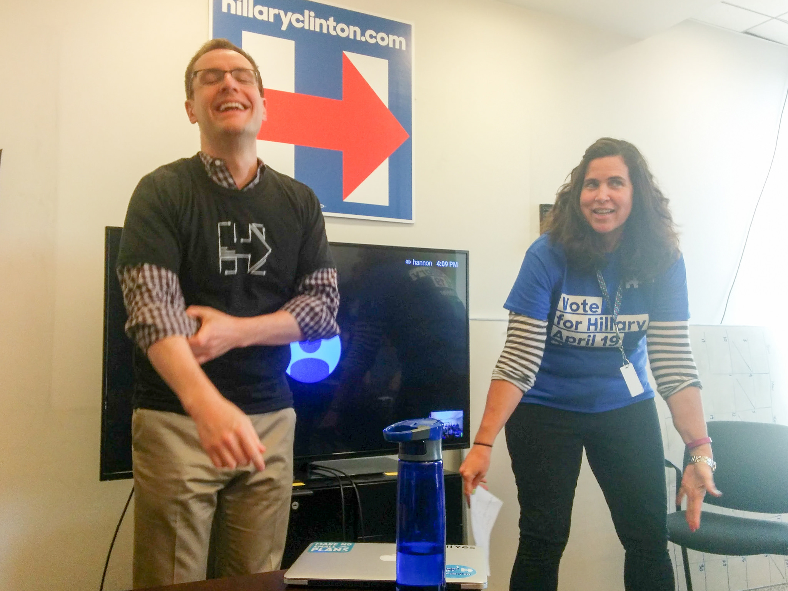

# Thank you.

Dear Steph,

How's it going? I am writing this to you from the past, November 7th, 2016. I have no idea where in the world you are, what you are doing, or what has happened since I started writing this. I am writing this letter, because I wanted to let you know, that no matter what happens, I appreciate you.

Rohen did all of the hard pitching to get me to join this team. He appealed to something that tends to get me every time: You can have an impact. I don't know if you realize this, but the environment you built let everyone have an impact. That sometimes had negative consequences, but more often that not, that let people succeed and keep on moving forward. Just as a small statistic: I've shipped more code in this job than I did in my four years at Google.

You also helped me verify a theory that I've had for a long time: I prefer teams that are diverse. This is the most diverse tech team I've ever worked on. It's the backgrounds, the ethnicities, the ages, the sexes, etc. Diverse on every axis. There were only eleven days in this campaign I haven't wanted to come into work, and each one was because I was tired, never because I didn't want to work with the people here.

So thank you Steph. I've had a wonder 293 days working for you. I am going to enjoy the next five, and remember all of them positively.

I once got a piece of advice, simple and sweet, which was find a good manager, and follow them. I've never really found someone before I'd willingly follow places, but in you, I've found that. You motivate me, inspire me and keep me pushing forward.

Best of luck in the future and please keep in touch. You've changed my life for the better.

Cheers,
/Nat

